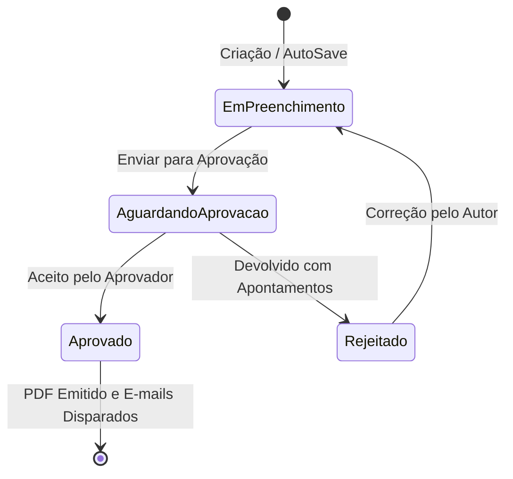

# 📘 Manual Completo e Regras de Negócio do Sistema (ObraFlow / ELP Consultoria)

> **Documento Oficial de Especificação Funcional, Regras de Negócio e Arquitetura UI/UX**  
> **Público-alvo**: Engenheiros, Consultores de Campo, Administradores, Gestores de Obra, Designers e Desenvolvedores.  
> **Linguagem**: Clara, explicativa e em linguagem natural.

---

## 📑 Sumário

1. [Visão Geral e Propósito do Sistema](#1-visão-geral-e-propósito-do-sistema)
2. [Perfis de Acesso, Usuários e Segurança](#2-perfis-de-acesso-usuários-e-segurança)
3. [Módulo de Obras (Projetos)](#3-módulo-de-obras-projetos)
4. [Módulo de Relatórios de Visita (Padrão)](#4-módulo-de-relatórios-de-visita-padrão)
5. [Módulo de Relatórios Express](#5-módulo-de-relatórios-express)
6. [Mecanismo de AutoSave (Salvamento Automático em Tempo Real)](#6-mecanismo-de-autosave-salvamento-automático-em-tempo-real)
7. [Gestão e Edição de Fotos Técnicas (Fabric.js)](#7-gestão-e-edição-de-fotos-técnicas-fabricjs)
8. [Fluxo de Governança, Revisão e Aprovação](#8-fluxo-de-governança-revisão-e-aprovação)
9. [Motor de Geração e Emissão de PDFs Profissionais](#9-motor-de-geração-e-emissão-de-pdfs-profissionais)
10. [Módulo de Agenda, Calendário e Visitas](#10-módulo-de-agenda-calendário-e-visitas)
11. [Módulo Financeiro e Solicitação de Reembolsos](#11-módulo-financeiro-e-solicitação-de-reembolsos)
12. [Sistema Multicanal de Notificações](#12-sistema-multicanal-de-notificações)
13. [Operação Offline e PWA (Progressive Web App)](#13-operação-offline-e-pwa-progressive-web-app)
14. [Integrações Externas e Backup em Nuvem](#14-integrações-externas-e-backup-em-nuvem)
15. [Guia Completo de UI/UX, Layout e Disposição de Botões (Página a Página)](#15-guia-completo-de-uiux-layout-e-disposição-de-botões-página-a-página)
16. [Tabela Resumo de Regras Críticas do Sistema](#16-tabela-resumo-de-regras-críticas-do-sistema)

---

## 1. Visão Geral e Propósito do Sistema

O **ObraFlow** (implantado para a **ELP Consultoria e Engenharia**) é uma plataforma tecnológica de nível corporativo projetada especificamente para empresas de engenharia diagnóstica, consultoria de obras civis e fiscalização técnica especializada em fachadas e revestimentos.

### O Problema que o Sistema Resolve
Em campo, o engenheiro ou perito precisa tirar dezenas de fotos, registrar patologias, marcar inconsistências na fachada, acompanhar o cumprimento de etapas de serviço, verificar conformidades com normas e prestar contas aos clientes e construtoras com agilidade. 

Tradicionalmente, isso gerava dias de trabalho manual após cada visita: descarregar fotos, renomear arquivos no computador, colar imagens no Word/PowerPoint, redigir legendas e converter para PDF.

### A Solução Oferecida
O sistema digitaliza todo o ciclo de ponta a ponta:
- **No Canteiro de Obras**: O engenheiro acessa pelo celular ou tablet (mesmo sem internet via PWA/offline), tira fotos diretamente pela câmera ou galeria, desenha setas e círculos na hora sobre a patologia, insere legendas predefinidas e preenche o checklist da obra.
- **Salvamento Contínuo**: O sistema salva tudo a cada 2 segundos silenciosamente em segundo plano, garantindo que nada se perca se o aplicativo for fechado ou a bateria acabar.
- **Controle de Qualidade e Governança**: O relatório não vai direto para o cliente; ele passa obrigatoriamente por um crivo técnico de aprovação (Aprovador Global ou Temporário).
- **Entrega Imediata e Automatizada**: Assim que o relatório é aprovado com um clique, o sistema compila o PDF com layout oficial da ELP e dispara os e-mails automaticamente para o autor, gestores, responsáveis e clientes, além de sincronizar uma cópia no Google Drive.

---

## 2. Perfis de Acesso, Usuários e Segurança

O sistema adota o princípio de privilégio mínimo e segregação de funções, garantindo que usuários operacionais não aprovem seus próprios trabalhos sem supervisão técnica e que os dados de cada obra sejam auditáveis.

### 2.1 Tipos de Usuários
1. **Master (`is_master = True`)**:
   - Administradores do sistema (diretoria e liderança técnica).
   - Possuem acesso irrestrito a configurações globais, cadastro de usuários, gestão de checklists mestre, configurações de e-mail corporativo, aprovação de reembolsos financeiros e painéis de auditoria.
2. **Developer (`is_developer = True`)**:
   - Perfil técnico de TI e manutenção.
   - Acesso a ferramentas de diagnóstico, logs de integração, testes de rotas e configurações de infraestrutura.
3. **Usuário Comum / Funcionário Operacional**:
   - Engenheiros e consultores de campo.
   - Podem cadastrar obras, criar visitas, preencher relatórios, solicitar reembolsos e consultar suas agendas de vistoria.
   - **Regra de Ouro**: Usuários comuns não podem aprovar relatórios (nem os seus próprios, nem os de colegas), garantindo a imparcialidade do laudo técnico.
4. **Aprovador Global**:
   - Um usuário único com a atribuição master de revisar e aprovar qualquer relatório de qualquer obra da empresa.
5. **Aprovadores Temporários**:
   - Engenheiros seniores designados pelo Aprovador Global para terem poder de aprovação restrito a determinadas obras específicas durante um período.
6. **Aprovador Express (`is_aprovador_express = True`)**:
   - Usuário com permissão especial para revisar e aprovar Relatórios Express (relatórios rápidos de vistorias avulsas).

### 2.2 Regras de Autenticação e Perfil Individual
- **Primeiro Login**: O sistema identifica quando é o primeiro acesso do usuário (`primeiro_login = True`) e direciona compulsoriamente para a redefinição de sua senha temporária.
- **Recuperação de Senha Segura**: Tokens de recuperação com tempo de expiração determinado via e-mail corporativo criptografado.
- **Cor da Agenda (`cor_agenda`)**: Cada funcionário possui uma cor hexadecimal única vinculada ao seu perfil. No calendário visual do sistema, todas as visitas agendadas para aquele técnico recebem automaticamente sua cor característica, permitindo rápida visualização de escala da equipe.
- **Configuração de E-mail Pessoal (`UserEmailConfig`)**: O sistema permite que cada usuário envie e-mails através de sua própria conta corporativa (Hostinger/Gmail) de forma transparente. A senha do e-mail é armazenada com **criptografia Fernet simétrica**, nunca em texto puro.

---

## 3. Módulo de Obras (Projetos)

Uma "Obra" (ou Projeto) é o centro de gravidade do sistema, ao qual se conectam relatórios, visitas, checklists, funcionários, clientes e custos.

### 3.1 Cadastro e Informações Obrigatórias
No cadastro de uma nova obra, o formulário segue uma ordenação intuitiva para o fluxo de engenharia:
- **Nome da Construtora**: Identifica a construtora responsável pela contratação.
- **Nome da Obra e Número de Identificação**: Código único gerado para catalogação (ex: `OBR-2026-001`).
- **Funcionário Responsável**: Engenheiro coordenador designado para acompanhar a edificação.
- **E-mail Principal**: Endereço oficial para comunicações contratuais daquela obra.
- **Tipo de Obra**: Residencial multifamiliar, comercial, retrofit, industrial, etc.
- **Localização e Coordenadas GPS**: Endereço textual e coordenadas geográficas (latitude e longitude) coletadas via mapa interativo Leaflet ou GPS do aparelho.
- **Numeração Inicial de Relatórios (`numeracao_inicial`)**:
  - *Regra*: Se uma obra já existia antes do sistema ou se o cliente exige começar pelo relatório nº 10, o gestor define a numeração de partida. Os relatórios futuros seguirão automaticamente a sequência 10, 11, 12... sem buracos.

### 3.2 Status e Ciclo da Obra
As obras são organizadas em abas visuais claras na tela inicial:
1. **Ativas**: Obras em andamento com vistorias regulares.
2. **Não Iniciadas**: Contratos fechados aguardando o início dos serviços ou emissão da ordem de serviço.
3. **Pausadas**: Obras paralisadas temporariamente pelo cliente.
4. **Concluídas**: Obras entregues e finalizadas.

### 3.3 Ordenação Inteligente por Proximidade (GPS)
- Quando o engenheiro abre a lista de obras no celular com a localização ativada, o sistema calcula a distância de cada canteiro usando a **fórmula de Haversine**. As obras mais próximas da localização física atual do engenheiro aparecem no topo da lista, poupando tempo na seleção da obra que está sendo visitada naquele momento.

### 3.4 Especificações Técnicas de Fachada
O sistema contém campos técnicos detalhados para registrar os padrões construtivos do projeto de fachada, servindo de guia rápido para o vistoriador:
- Elementos construtivos base (concreto armado, alvenaria de blocos cerâmicos/concreto);
- Especificação de chapisco colante e chapisco de alvenaria;
- Argamassa de emboço e sua forma de aplicação (manual ou projetada);
- Acabamentos de revestimento, peitoris e muretas;
- Definição de frisos, juntas de dilatação e cores;
- Caimento e acabamento da face inferior de abas;
- Observações gerais da consultoria de fachada.

### 3.5 Categorias Personalizáveis por Obra
- Cada empreendimento possui particularidades. Uma obra pode ter torres chamadas "Torre Alfa" e "Torre Beta", enquanto outra é dividida por "Fachada Norte", "Fachada Sul", "Pilotis" ou "Subsolo".
- O sistema permite criar categorias sob medida para cada obra, que serão usadas posteriormente para agrupar as fotos nos relatórios.

### 3.6 Checklists de Obra (Global vs. Personalizado)
- O sistema conta com um **Checklist Padrão Mestre** com os itens essenciais de boas práticas construtivas.
- Para obras com exigências específicas, a obra pode alternar para o modo de **Checklist Personalizado**, permitindo adicionar, editar, excluir e reordenar itens específicos para aquele canteiro.

### 3.7 Contatos de Clientes e Distribuição Automática
- Na aba de contatos da obra, cadastram-se os destinatários (engenheiros da construtora, síndicos, fiscais do cliente).
- Para cada contato, define-se:
  - Se ele recebe notificações do sistema;
  - Se ele recebe automaticamente os relatórios aprovados em PDF.

### 3.8 Lembretes Persistentes da Obra
- Lembretes criados em visitas anteriores ficam fixados na tela da obra e no formulário do relatório seguinte até que sejam explicitamente dados como resolvidos por um técnico, impedindo que pendências críticas caiam no esquecimento.

---

## 4. Módulo de Relatórios de Visita (Padrão)

O Relatório de Visita é o documento técnico oficial entregue ao cliente após cada vistoria.

### 4.1 Estrutura e Sequência dos Campos
O formulário de preenchimento do relatório foi desenhado priorizando o uso móvel:
1. **Data da Visita**: Campo prioritário no início da página.
2. **Seleção da Obra**: Obras ordenadas por distância física.
3. **Número do Relatório**: Calculado e atribuído automaticamente pela regra da obra (não editável de forma acidental para evitar conflitos de duplicidade).
4. **Informações Técnicas da Obra**: Exibidas em sanfona/colapsável para consulta rápida sem poluir a tela.
5. **Acompanhantes da Visita**: Lista multi-seleção de quem acompanhou a vistoria (engenheiro residente, mestre de obras, estagiário, encarregado).
6. **Checklist da Obra**:
   - Itens a serem vistoriados naquele dia.
   - **Regra**: Conforme um item do checklist é inspecionado e marcado como concluído, ele fica registrado com o ID daquele relatório e deixa de poluir os relatórios futuros da obra.
7. **Observações Gerais**: Campo de texto livre para diagnóstico, considerações técnicas e apontamentos macro.
8. **Lembrete para a Próxima Visita**: Registro de itens que o consultor precisa checar especificamente no retorno.
9. **Galeria de Fotos com Anotações**: O coração visual do relatório.

### 4.2 Status do Ciclo de Vida do Relatório


- **`Em preenchimento` (ou `em_andamento`)**: Rascunho editável pelo autor.
- **`Aguardando Aprovação`**: Trancado para edição pelo autor; enviado para a fila do Aprovador Global ou Temporário daquela obra.
- **`Aprovado`**: Documento final selado. O sistema compila o PDF, registra a data de aprovação, bloqueia alterações e despacha para os clientes.
- **`Rejeitado`**: Retorna ao autor acompanhado de um parecer obrigatório do aprovador explicando o que deve ser corrigido.

---

## 5. Módulo de Relatórios Express

### O que é o Relatório Express?
O **Relatório Express** foi criado para atender vistorias pontuais, peritagens emergenciais, orçamentos ou visitas técnicas em locais onde a obra ainda não possui um cadastro completo prévio na base de dados.

### Diferenças e Regras do Relatório Express
1. **Sem Dependência de Obra Cadastrada**: Os dados da obra e cliente (Nome da Empresa, Nome da Obra, Endereço, Responsável, Telefone, E-mail) são preenchidos diretamente dentro do próprio relatório (*inline*).
2. **Paridade de Recursos**: Possui rigorosamente a mesma qualidade técnica do relatório padrão:
   - Suporte ao editor de fotos com anotações e setas;
   - Checklist simplificado;
   - Observações gerais e lembretes;
   - Geração de PDF padronizado com identidade visual da ELP.
3. **Aprovação Própria**: Conta com flag de aprovação específica (`is_aprovador_express`), permitindo descentralizar vistorias express sem sobrecarregar a mesa do aprovador geral de grandes contratos.

---

## 6. Mecanismo de AutoSave (Salvamento Automático em Tempo Real)

Uma das maiores inovações de engenharia de software presentes no sistema é o mecanismo de **AutoSave Inteligente**, evitando perdas de trabalho em campo.

### Regras do Funcionamento do AutoSave:
1. **Ativação Transparente**: Assim que um relatório é criado, o sistema associa o atributo `data-report-id` ao formulário e inicializa o observador em segundo plano com validação de segurança anti-falsificação (CSRF Token).
2. **Debounce de 2 a 3 Segundos**: O sistema aguarda o usuário parar de digitar por 2 segundos antes de enviar o pacote de alteração ao servidor, evitando requisições desnecessárias.
3. **Escopo Completo de Sincronização**: O salvamento automático não guarda apenas textos; ele salva:
   - Textos (título, observações gerais, observações finais);
   - Datas e lembretes;
   - Array completo de acompanhantes em JSONB;
   - Estado de cada item do checklist e suas notas;
   - Categoria e local selecionados;
   - Coordenadas geográficas;
   - Metadados e uploads temporários de fotos.
4. **Ciclo de Upload em Dois Passos para Imagens no AutoSave**:
   - Para não travar a tela com arquivos pesados de fotos, ao subir uma nova imagem, o sistema realiza um upload assíncrono temporário para `/api/uploads/temp`.
   - O servidor retorna um identificador temporário (`temp_id`).
   - O AutoSave vincula esse `temp_id` ao rascunho do relatório.
   - Quando o relatório é persistido, o servidor promove a imagem para o banco de dados oficial e confirma o ID definitivo.
5. **Resiliência a Quedas de Conexão**: Se a requisição HTTP falhar (por exemplo, oscilação de sinal 4G no canteiro), o frontend guarda o estado no `localStorage` do navegador e repete a tentativa com espera exponencial (*exponential backoff*) até reestabelecer o contato.

---

## 7. Gestão e Edição de Fotos Técnicas (Fabric.js)

A evidência fotográfica é a espinha dorsal de qualquer laudo de vistoria de fachada. O sistema incorpora um verdadeiro estúdio gráfico integrado.

### 7.1 Regras de Identificação de Cada Foto
Cada foto adicionada ao relatório recebe:
- **Legenda (Obrigatória)**: Texto explicativo do problema encontrado. Pode ser digitada manualmente ou selecionada com um clique a partir do catálogo de **Legendas Predefinidas** cadastradas no sistema.
- **Categoria (Opcional)**: Vinculada às categorias cadastradas na obra (ex: "Fachada Leste", "Mureta da Cobertura").
- **Local (Opcional)**: Complemento específico (ex: "14º Pavimento - Vão da Janela 02").
- **Ordem de Exibição**: Posição numérica da foto no relatório. Pode ser alterada facilmente por arrastar e soltar (*drag and drop*).

### 7.2 Ferramentas do Editor Gráfico Integrado
Ao clicar em "Editar Foto", abre-se um canvas interativo movido a **Fabric.js** com ferramentas sob medida para engenharia:
- **Desenho Livre (Pincel)**: Com espessura e cores configuráveis (vermelho chamativo para patologias, amarelo para avisos, verde para conformidades).
- **Formas Geométricas**:
  - **Setas Indicativas**: Para apontar fissuras, descolamentos ou infiltrações com precisão cirúrgica.
  - **Retângulos e Círculos**: Para delimitar áreas com manchas, trincas ou falhas de rejunte.
  - **Linhas Retas**: Para indicar prumos e alinhamentos.
- **Caixas de Texto**: Inserção de anotações textuais diretamente sobre a imagem.
- **Filtros Fotográficos**:
  - Ajuste de Brilho e Contraste (essencial para fotos tiradas em áreas sombreadas de canteiro);
  - Saturação, Nitidez e modo Preto e Branco.
- **Histórico**: Botões de Desfazer (*Undo*) e Refazer (*Redo*) ilimitados durante a edição.

### 7.3 Arquitetura de Armazenamento Híbrido
- As fotos originais e as fotos anotadas são convertidas e armazenadas de forma primária no banco de dados **PostgreSQL em colunas binárias (`BYTEA`)** com cálculo de hash criptográfico **SHA-256** para evitar arquivos duplicados e garantir a integridade pericial.
- Como contingência de alta performance, o sistema também mantém espelhos no sistema de arquivos do servidor (`uploads/`).

---

## 8. Fluxo de Governança, Revisão e Aprovação

O sistema implementa uma camada rígida de controle de qualidade antes de qualquer documento chegar aos clientes externos.

### 8.1 Quem Pode Aprovar?
- A tela de revisão e os botões de ação ("Aprovar" e "Rejeitar") ficam disponíveis **exclusivamente** para:
  1. O **Aprovador Global**;
  2. O **Aprovador Temporário** explicitamente associado àquela obra;
  3. O **Aprovador Express** (para relatórios do tipo Express).
- Para qualquer outro usuário (inclusive o autor ou usuários comuns), o relatório aparece apenas em modo de leitura aguardando decisão técnica.

### 8.2 Ação de Rejeição
- Se o aprovador encontrar fotos sem legenda, erro na indicação de um traço de argamassa ou falta de informações de campo, ele aciona **Rejeitar**.
- **Regra**: O sistema exige o preenchimento de uma justificativa formal de reprovação (`comentario_aprovacao`).
- O relatório volta ao status de preenchimento, e o autor recebe imediatamente uma notificação no sistema e por e-mail com as correções solicitadas.

### 8.3 Ação de Aprovação
Quando o relatório é aprovado, o sistema executa uma sequência atômica e coordenada:
1. **Validação e Transação Única de Banco**: Atualiza o status para `Aprovado`, crava o carimbo de data/hora atual e o ID do aprovador, e consolida o banco de dados antes de iniciar processos externos (evitando deadlocks).
2. **Compilação do PDF Oficial**: O sistema processa os dados e compila o PDF oficial pronto para entrega.
3. **Disparo Automático de E-mails**: Envia e-mails corporativos com o PDF anexado para todos os envolvidos cadastrados:
   - Autor do relatório;
   - Aprovador global;
   - Responsável técnico da obra;
   - Acompanhantes da vistoria;
   - Clientes cadastrados na obra com flag ativa para receber relatórios.
4. **Notificação Multicanal**: Registra a notificação no painel do usuário e envia push notification.
5. **Cópia de Segurança no Google Drive**: Se a integração estiver ativa, envia o PDF para a pasta correspondente na nuvem.

---

## 9. Motor de Geração e Emissão de PDFs Profissionais

O documento emitido pelo sistema reflete o padrão visual institucional da **ELP Consultoria e Engenharia**.

### 9.1 Elementos Gráficos e Estrutura do Documento
- **Capa / Cabeçalho Institucional**: Logotipo oficial de alta resolução, informações de contato corporativo e numeração formatada do relatório (ex: `Relatório de Visita Técnica nº 012/2026`).
- **Quadro Resumo de Identificação**:
  - Dados da Obra, Construtora e Endereço;
  - Data da realização da visita;
  - Responsável técnico emissor e número de registro profissional;
  - Lista de acompanhantes presentes no canteiro.
- **Painel de Informações Técnicas e Checklist**:
  - Resumo das etapas vistoriadas e status das verificações de campo.
- **Corpo Descritivo e Parecer da Visita**:
  - Texto das observações gerais, diagnósticos, testes realizados e recomendações de engenharia.
- **Galeria Técnica de Pranchas Fotográficas**:
  - Fotos dispostas em grid organizado de forma elegante;
  - Numeração sequencial contínua (*Foto 01, Foto 02, Foto 03...*);
  - Exibição destacada da **Categoria**, do **Local** e da **Legenda Descritiva** sob cada foto;
  - Renderização fiel de todas as anotações gráficas (setas, círculos e textos desenhados pelo engenheiro).
- **Rodapé Padronizado**: Numeração automática de páginas (*Página X de Y*) e data/hora de emissão do laudo.

---

## 10. Módulo de Agenda, Calendário e Visitas

O módulo de visitas organiza a logística e o deslocamento das equipes técnicas em campo.

### 10.1 Calendário Interativo (FullCalendar)
- Visualização completa por mês, semana ou dia.
- **Filtro de Horário Padrão de Canteiro**: Focado na faixa comercial e de obras (7h às 18h).
- **Código de Cores por Técnico**: As visitas são coloridas de acordo com a cor do perfil do funcionário escalado, facilitando identificar a divisão da equipe na semana com um simples relance visual.

### 10.2 Agendamento de Visitas
- Ao criar uma visita, o usuário informa:
  - Obra vinculada (ou seleção de "Outros" para reuniões externas);
  - Opção de **Compromisso Pessoal** (para proteger a privacidade de compromissos particulares do profissional na agenda compartilhada);
  - Data e horários previstos de início e fim;
  - Responsável principal e lista de participantes adicionais da equipe;
  - Objetivo e atividades planejadas.

### 10.3 Registro em Campo com GPS
- Ao chegar no local, o engenheiro pode acionar o registro da visita. O sistema captura as coordenadas de latitude e longitude via sensor GPS do celular, comprovando a presença física no canteiro.

### 10.4 Vínculo Inteligente com Relatórios
- Uma visita agendada pode ser convertida diretamente na abertura do formulário de relatório daquela obra, herdando a data, o engenheiro e os dados já informados.

---

## 11. Módulo Financeiro e Solicitação de Reembolsos

Projetado para eliminar planilhas avulsas e recibos em papel de deslocamento dos consultores.

### 11.1 Registro de Despesas por Período e Obra
O engenheiro registra seus gastos de viagem vinculados a um projeto:
- **Quilometragem (Km)**: Informa os quilômetros rodados em veículo próprio. O sistema multiplica automaticamente pela taxa cadastrada por quilômetro (`valor_km`).
- **Alimentação**: Gastos com refeições durante viagens.
- **Hospedagem**: Diárias em hotéis para obras fora da sede.
- **Outros Gastos**: Pedágios, estacionamentos, materiais de consumo rápido de campo.
- **Comprovantes**: Upload de fotos de notas fiscais, cupons fiscais e comprovantes de pedágio.

### 11.2 Fluxo de Aprovação Financeira
- O pedido entra com status `Pendente`.
- O administrador Master acessa a central de reembolsos, confere os comprovantes anexados e valores e clica em **Aprovar** ou **Rejeitar**.
- O sistema grava quem aprovou e a data da homologação, gerando transparência para o fechamento contábil.

---

## 12. Sistema Multicanal de Notificações

O sistema mantém toda a equipe sincronizada por meio de três canais simultâneos de comunicação:

### 12.1 Central Interna de Notificações
- Ícone de sino no cabeçalho com contador em tempo real (*badge*) de avisos não lidos.
- Avisa sobre: novo relatório submetido para aprovação, relatório aprovado, relatório reprovado com correções, novo agendamento de visita ou obra atribuída ao funcionário.
- Notificações lidas podem ser arquivadas e possuem tempo de vida configurável.

### 12.2 Notificações Push (OneSignal e Firebase Cloud Messaging)
- Funciona tanto no navegador do computador quanto no celular (via PWA).
- Avisa o engenheiro ou gestor instantaneamente, mesmo que o aplicativo esteja com a aba fechada.
- Suporta múltiplos dispositivos por usuário através da tabela `UserDevice`.

### 12.3 E-mails Automáticos Transacionais
- Envio via servidores SMTP configurados (Hostinger ou Gmail).
- Templates em HTML responsivo e profissional.
- Registro completo de auditoria na tabela `LogEnvioEmail` (registrando data, destinatários, assunto, se teve sucesso ou a mensagem técnica do erro em caso de falha de conexão).

---

## 13. Operação Offline e PWA (Progressive Web App)

Como canteiros de obras frequentemente se localizam em subsolos, áreas remotas ou pavimentos sem cobertura de sinal de telefonia, o sistema foi concebido com arquitetura **Mobile-First e Offline-First**.

### 13.1 Instalação sem Loja de Aplicativos (PWA)
- Através do `manifest.json` e do ícone do ELP Consultoria, o usuário pode clicar em "Adicionar à Tela de Início" no Safari (iOS) ou Chrome (Android).
- O aplicativo passa a rodar em tela cheia, com visual e performance de aplicativo nativo, sem barras de navegador.

### 13.2 Armazenamento Local e Sincronização
- Os arquivos estáticos e telas de formulário ficam armazenados no cache do aparelho via **Service Worker**.
- Ao criar vistorias sem internet, os dados e fotos ficam retidos no banco de dados local do navegador (`IndexedDB` / `localStorage`).
- Assim que o dispositivo detecta conexão Wi-Fi ou sinal 4G/5G, a fila de sincronização é processada automaticamente, enviando os dados salvos para a base em nuvem da empresa.

---

## 14. Integrações Externas e Backup em Nuvem

### 14.1 Google Drive API
- Permite backup automatizado em nuvem corporativa.
- Autenticação OAuth 2.0 segura com armazenamento de tokens e refresh tokens criptografados.
- Ao aprovar relatórios, o sistema cria automaticamente a estrutura de diretórios no Google Drive da empresa:  
  `[Nome da Empresa / Cliente] ➔ [Nome da Obra] ➔ Relatórios em PDF`

### 14.2 Geolocalização (Leaflet.js + Geopy + Geolocation API)
- Captura de coordenadas GPS do dispositivo no momento da visita.
- Geocodificação reversa para transformar latitude/longitude no endereço postal da rua e bairro.
- Exibição de mapas interativos para confirmação de localização da obra.

---

## 15. Guia Completo de UI/UX, Layout e Disposição de Botões (Página a Página)

Esta seção documenta a arquitetura de interface e a experiência do usuário (**UI/UX**) de ponta a ponta, detalhando a hierarquia visual, o layout responsivo e a posição exata de cada botão e controle do sistema.

```
┌────────────────────────────────────────────────────────────────────────┐
│  NAVBAR: [Logo ELP]  [Obras] [Visitas ▾] [Relatórios ▾] [Express ▾] ...│
├────────────────────────────────────────────────────────────────────────┤
│                                                                        │
│  CONTEÚDO PRINCIPAL (Cards, Grids, Sanfonas, Galeria Fotográfica)       │
│                                                                        │
├────────────────────────────────────────────────────────────────────────┤
│  BARRA DE AÇÕES INFERIOR: [Ação Secundária/Esquerda]    [Ação Principal/Direita]│
└────────────────────────────────────────────────────────────────────────┘
```

---

### 15.1 Barra de Navegação Global (Navbar) e Gaveta de Notificações

#### Objetivo e Comportamento
A **Navbar Superior** é fixa e responsiva, garantindo acesso imediato aos módulos operacionais sem sobrecarregar a área útil da tela em dispositivos móveis.

#### Layout e Componentes
1. **Lado Esquerdo**:
   - **Logotipo Institucional**: Imagem da marca ELP com link direto para a página inicial/dashboard.
   - **Botão Toggle (Menu Hamburguer)**: Em telas menores que 992px (smartphones e tablets), condensa o menu em um painel expansível com toque suave.
2. **Centro (Links de Navegação Principal)**:
   - **Obras** (`<i class="fas fa-hard-hat">`): Link direto para a lista de obras ativas/cadastradas.
   - **Visitas (Dropdown)** (`<i class="fas fa-calendar-check">`):
     - *Nova Visita*: Abre o formulário de agendamento;
     - *Listar Visitas*: Exibição tabular de visitas com filtros;
     - *Calendário*: Vista interativa FullCalendar mensal/semanal.
   - **Relatórios (Dropdown)** (`<i class="fas fa-file-alt">`):
     - *Listar Relatórios*: Painel com todos os laudos técnicos e seus status.
   - **Relatório Express (Dropdown)** (`<i class="fas fa-bolt">` em amarelo):
     - *Criar novo relatório express*: Acesso direto para vistoria avulsa;
     - *Listar relatórios express*: Arquivo histórico de relatórios rápidos.
   - **Administração (Dropdown)** (visível apenas para usuários Master):
     - Links para Usuários, E-mails de Clientes, Legendas, Aprovadores Padrão, Checklist Padrão e Backup Google Drive.
   - **Desenvolvedor (Dropdown)** (visível para perfis Developer):
     - Atalhos para gerenciamento avançado e ferramentas de depuração.
3. **Lado Direito**:
   - **Perfil do Usuário**: Menu dropdown com nome completo, cargo em destaque, atalho para "Instalar App no Celular" (guia PWA) e botão vermelho de "Sair" (Logout).
   - **Sino de Notificações**: Ícone `<i class="fas fa-bell">` com **Badge Vermelho Flutuante** indicando o número exato de avisos pendentes.
4. **Gaveta Lateral de Notificações (Offcanvas)**:
   - Acionada ao tocar no sino; desliza suavemente a partir do canto direito da tela.
   - **Cabeçalho Azul**: Título "Notificações" e botão `X` de fechamento.
   - **Barra de Ações Rápidas**: Indicador "X não lidas", botão `<i class="fas fa-check-double">` (Marcar todas como lidas) e `<i class="fas fa-trash">` (Limpar).
   - **Corpo da Gaveta**: Lista de cards verticais clicáveis que direcionam o técnico direto para o relatório ou obra em questão.

---

### 15.2 Tela de Login e Primeiro Acesso

#### Objetivo
Autenticação rápida, acessível e segura, desenhada para utilização frequente com apenas uma mão no celular.

#### Layout e Disposição
- **Card Centralizado**: Card elevado com cantos arredondados e sombra suave sobre fundo claro profissional.
- **Cabeçalho do Card**: Ícone de capacete de engenharia (`fa-hard-hat`) em azul-petróleo, seguido pelo título "Sistema de Obras" e subtítulo institucional.
- **Campos**:
  1. *Usuário*: Campo com texto explicativo e validação em linha.
  2. *Senha*: Campo agrupado com botão integrado de **"Olho" (`fa-eye` / `fa-eye-slash`)** à direita. Permite que o engenheiro confira a senha digitada em campo sem erros de digitação.
- **Botão Principal**:
  - **Entrar**: Botão azul largo ocupando **100% da largura** do card (`btn-primary w-100 py-2 fw-bold`), garantindo clique fácil em telas de toque.
- **Rodapé do Card**: Link discreto "Esqueci minha senha" para recuperação automatizada por e-mail.

---

### 15.3 Dashboard Principal (Página Inicial)

#### Layout e Disposição
- **Linha de Boas-Vindas**: Saudação personalizada com o nome do engenheiro e a data por extenso.
- **Cards de Métricas Rápidas (Grid Superior)**:
  - 4 cards coloridos em gradiente:
    - *Obras Ativas* (Verde);
    - *Visitas Agendadas* (Azul);
    - *Relatórios em Preenchimento* (Amarelo);
    - *Relatórios Aprovados* (Ciano).
- **Barra de Ações Rápidas em Destaque**:
  - Três botões largos com ícones grandes para operação ágil:
    - `[+ Nova Visita]` (Botão Outline Azul);
    - `[+ Novo Relatório de Obra]` (Botão Sólido Azul);
    - `[⚡ Relatório Express]` (Botão Amarelo com Raio).
- **Listagem de Compromissos Imediatos**:
  - Tabela responsiva com as visitas da semana e atalho rápido para "Iniciar Relatório".

---

### 15.4 Página de Listagem de Obras (`/projects`)

#### Objetivo
Permitir a localização instantânea da obra desejada, quer por digitação rápida, quer pela proximidade física do canteiro.

#### Layout e Componentes
1. **Cabeçalho da Página**:
   - Título dinâmico à esquerda com ícone de prédio (`fa-building`), que altera o nome conforme o filtro ativo ("Obras Ativas", "Obras Não Iniciadas", "Obras Pausadas", "Obras Concluídas").
   - **Botão "+ Nova Obra"**: Posicionado no canto superior direito (`btn-primary`), destacado com ícone de soma.
2. **Abas de Filtro por Status (Botões Grandes em Grid)**:
   - Em vez de abas tradicionais minúsculas, utiliza **4 botões estilizados** dispostos em grade (2x2 no mobile, 4 colunas no desktop):
     - **Ativas**: Verde gradiente com ícone `<i class="fas fa-check-circle">`;
     - **Não iniciadas**: Cinza escuro elegante com `<i class="fas fa-clock">`;
     - **Pausadas**: Amarelo alaranjado com `<i class="fas fa-pause-circle">`;
     - **Concluídas**: Azul profundo com `<i class="fas fa-flag-checkered">`.
   - *Comportamento*: O botão da aba ativa ganha elevação, borda brilhante e fundo preenchido; os inativos ficam com borda colorida e fundo suave.
3. **Barra de Busca Rápida**:
   - Card fino com campo de entrada largo: `🔍 Digite o nome, número ou construtora da obra...` e botão de lupa para busca instantânea.
4. **Grid de Cards de Obras (Design Clicável)**:
   - Cada obra é representada por um card com efeito visual de elevação ao passar o mouse (*hover transition*).
   - **Topo do Card**: Nome da obra em negrito, código único (ex: `OBR-005`) e construtora.
   - **Tag de Proximidade GPS**: Se o GPS estiver ativado, exibe badge com a distância: `📍 A 1.2 km de você`.
   - **Corpo do Card**: Engenheiro responsável, e-mail principal cadastrado e contador de relatórios já emitidos.
   - **Regra de UX de Navegação**: **O card inteiro é uma área clicável**. Tocar em qualquer ponto do card abre a página de detalhes daquela obra, evitando cliques acidentais em botões pequenos no celular.

---

### 15.5 Formulário de Criação e Edição de Obra (`/projects/new` e `/projects/<id>/edit`)

#### Objetivo
Cadastrar com precisão técnica todos os dados da edificação sem cansar o usuário.

#### Ordem Exata dos Campos (Top-to-Bottom)
1. **Nome da Construtora** (1º campo da tela, em atendimento às diretrizes de operação da empresa).
2. **Nome da Obra** e **Código/Número de Identificação**.
3. **Tipo de Obra** (dropdown: Residencial, Comercial, Misto, Retrofit, etc.).
4. **Funcionário Responsável** (dropdown dos técnicos da empresa).
5. **E-mail Principal da Obra** (obrigatório, para comunicações padrão).
6. **Numeração Inicial de Relatórios (`numeracao_inicial`)**: Campo numérico para sincronizar o início dos relatórios.
7. **Endereço Completo e Geolocalização**:
   - Campo de endereço em texto com botão `[Capturar GPS Atual]`;
   - Mapa interativo Leaflet logo abaixo, onde o engenheiro pode ajustar o alfinete com precisão no lote exato.
8. **Especificações Técnicas de Fachada (Sanfona Colapsável Roxa)**:
   - Agrupamento expansível contendo os 12 campos técnicos de materiais (chapisco, argamassa de emboço, peitoris, caimentos, frisos e detalhes de projeto).
9. **Disposição dos Botões de Ação no Rodapé do Formulário**:
   - **Lado Esquerdo**: Botão **"Cancelar"** (`btn-outline-secondary`), que retorna à listagem sem salvar.
   - **Lado Direito**: Botão **"Salvar Obra"** (`btn-primary fw-bold px-4 py-2`), com ícone de disquete `<i class="fas fa-save">`.

---

### 15.6 Página de Visualização e Detalhes da Obra (`/projects/<id>`)

#### Layout e Componentes
1. **Indicador Visual de Status (Faixa Superior)**:
   - Alerta em gradiente sólido (verde para Ativa, amarelo para Pausada, etc.) informando o estado da edificação.
2. **Linha de Título e Ações Rápidas**:
   - Título da obra com código entre parênteses.
   - Menu hambúrguer de atalhos internos.
   - **Grupo de Botões do Topo**:
     - Botão verde **"E-mails do Cliente"** (`fa-envelope`): Gerencia quem recebe os laudos;
     - Botão dropdown amarelo **"Alterar Status"**: Permite pausar ou reativar a obra;
     - Botão azul principal **"Criar Relatório"** (CTA Mobile de destaque).
3. **Bloco Superior de Informações**:
   - Card esquerdo: Dados contratuais, responsável, endereço com mapa e contatos.
   - Card direito: Estatísticas consolidadas (Total de Visitas, Relatórios Normais, Relatórios Express e Comunicações).
4. **Painel de Especificações Técnicas de Fachada (Design Roxo)**:
   - Card com borda lateral roxa (`#6f42c1`) exibindo a ficha completa de argamassas, revestimentos e diretrizes de projeto.
5. **Painel de Progresso do Checklist**:
   - Barra de progresso percentual dinâmica e botão "Configurar" para personalizar itens.
6. **Abas de Navegação Inferiores**:
   - *Aba Relatórios*: Tabela completa de laudos com número, data, autor, status e atalho de visualização;
   - *Aba Visitas*: Grade de vistorias com histórico e agendamentos;
   - *Aba Comunicações*: Mural de recados técnicos da obra;
   - *Aba Categorias*: Gerenciador de setores e fachadas da obra.
7. **Botão de Edição da Obra no Rodapé**:
   - Em atendimento estrito à validação de usabilidade, o botão **"Editar Obra"** fica posicionado **no rodapé da página**, liberando o topo exclusivamente para ações de vistoria e emissão de relatórios.

---

### 15.7 Formulário de Preenchimento do Relatório de Obra (`/reports/new` e `/reports/<id>/edit-complete`)

#### Objetivo
O ambiente de trabalho mais utilizado pelos consultores. Pensado para velocidade máxima em smartphones no canteiro.

#### Layout e Sequência de Campos
1. **Cabeçalho com Indicador de AutoSave em Tempo Real**:
   - Título "Relatório de Obra", Badge amarelo "Em preenchimento" e à direita o texto dinâmico:  
     `🟢 Salvo automaticamente às 14:32:05` ou `⏳ Salvando...`.
2. **Data do Relatório (1º Campo Superior)**:
   - Posicionada no topo absoluto da página para ajuste imediato da data da vistoria.
3. **Seleção da Obra**:
   - Select dinâmico ordenado por distância geográfica. Ao escolher a obra, o sistema carrega silenciosamente as categorias, os acompanhantes e os checklists dela.
4. **Número do Relatório**:
   - Exibido em modo somente leitura (calculado pelo sistema a partir da regra sequencial da obra).
5. **Sanfona Colapsável 1: Informações Técnicas da Obra**:
   - Barra azul-petróleo com botão de expansão e ícone chevron giratório. Permite consultar as argamassas e detalhes do projeto com um toque sem sair do preenchimento.
6. **Sanfona Colapsável 2: Checklist da Obra**:
   - Barra grafite escura com contador de pendências.
   - Lista de checkboxes grandes (área de toque de 48px). Itens marcados ganham fundo verde suave e campo opcional para anotação rápida.
7. **Card de Acompanhantes da Visita**:
   - Cabeçalho com botão `[+ Adicionar]` que abre modal intuitivo para cadastrar novos participantes (nome, cargo e empresa) ou selecionar nomes habituais.
8. **Observações Gerais**:
   - Caixa de texto limpa com 4 linhas de altura inicial, ajustável dinamicamente.
9. **Galeria de Fotos Mobile-First**:
   - **Barra Flutuante Fixa (Sticky Top)**:
     - Fica presa no topo enquanto o usuário rola a tela de fotos;
     - Dois botões gigantes e ergonômicos:
       - **Botão Câmera** (Azul, 56px de altura, ícone grande);
       - **Botão Galeria** (Verde, 56px de altura, ícone grande).
     - Contador total de fotos (ex: `12 / 200 fotos`).
   - **Cards Individuais de Foto**:
     - Miniatura de alta definição da imagem;
     - Botão "Editar Foto" (abre o canvas com Fabric.js);
     - Seletor de Categoria (vinculado à obra);
     - Campo de Local (especificação do pavimento/vão);
     - **Campo de Legenda Obrigatória** com botão integrado para selecionar Legendas Predefinidas da ELP;
     - Botão vermelho de excluir foto e alça de toque para arrastar e reordenar.
10. **Card de Lembrete para a Próxima Visita**:
    - Textarea para apontar pendências que devem ser revistas no retorno à obra, com botão `[+ Adicionar Lembrete]`.
11. **Barra Inferior de Ações Finais (Disposição Estrita de Botões)**:
    - **Lado Esquerdo**: Botão **"Enviar para Aprovação"** (`btn-warning text-dark fw-bold py-2 px-4`), com ícone de avião `<i class="fas fa-paper-plane">`. Submete o laudo à mesa do aprovador.
    - **Lado Direito**: Botão **"Salvar / Concluir Relatório"** (`btn-primary fw-bold py-2 px-4`), com ícone de disquete `<i class="fas fa-save">`. Salva as alterações sem fechar o ciclo de rascunho.

---

### 15.8 Página de Revisão e Mesa de Aprovação (`/reports/<id>/review`)

#### Objetivo
Ambiente exclusivo para os Aprovadores homologarem o laudo com segurança ou solicitarem ajustes formais.

#### Layout e Componentes
1. **Cabeçalho de Revisão**:
   - Título com número do relatório e autor;
   - Botão superior "Voltar" e botão "Visualizar PDF" (se já aprovado).
2. **Painel de Status**:
   - Card com badge destacado informando se o documento está "Aguardando Aprovação", "Aprovado" ou "Rejeitado".
3. **Corpo do Laudo em Modo de Leitura Pericial**:
   - Resumo da obra, data da visita e equipe de acompanhantes;
   - Parecer técnico das observações gerais;
   - Resumo das verificações de checklist;
   - Prancha fotográfica completa: ao tocar em qualquer foto, ela se expande em modal de alta resolução para inspeção minuciosa de fissuras e patologias.
4. **Card de Decisão do Aprovador (Visível Apenas para Aprovadores Designados)**:
   - Em smartphones, os botões empilham verticalmente em largura total; em computadores, ficam dispostos lado a lado:
     - **Botão "Aprovar Relatório"** (`btn-success btn-lg flex-fill fw-bold`): Cor verde sólida com ícone de check. Pede confirmação e executa a aprovação com disparo de PDF e e-mails.
     - **Botão "Editar Relatório"** (`btn-primary btn-lg flex-fill`): Permite que o próprio aprovador faça uma correção pontual de texto sem devolver o relatório.
     - **Botão "Reprovar Relatório"** (`btn-danger btn-lg flex-fill fw-bold`): Cor vermelha sólida com ícone de `X`.
5. **Modal de Justificativa de Reprovação**:
   - Acionado ao clicar em Reprovar.
   - Cabeçalho vermelho com aviso de que o autor será notificado;
   - Textarea obrigatório: **"Motivo da Reprovação"**;
   - Rodapé do Modal: Botão "Cancelar" à esquerda e botão vermelho "Confirmar Reprovação" à direita.

---

### 15.9 Formulário do Relatório Express (`/reports/express/new`)

#### Objetivo
Atender vistorias avulsas sem cadastro prévio de obra, com preenchimento em tela única fluida.

#### Ordem Linear dos Campos
1. **Título do Relatório** (ex: "Relatório Express de Visita").
2. **Número do Relatório** (gerado automaticamente no padrão `EXP-0001`, somente leitura).
3. **Data do Relatório** (campo de data editável).
4. **Cliente** (campo textual com nome do cliente ou construtora).
5. **Nome da Obra** (campo textual obrigatório).
6. **Endereço da Obra**:
   - Input de texto com botão integrado `[GPS]` que preenche rua, número e bairro com um clique via satélite.
7. **Funcionários da Visita**:
   - Card azul com botão `+ Adicionar` para incluir acompanhantes.
8. **Informações Técnicas e Checklist Express**:
   - Painéis retráteis para especificações da vistoria.
9. **Observações Gerais**:
   - Textarea amplo para diagnóstico e parecer.
10. **Galeria de Fotos com Botões Câmera e Galeria**:
    - Idêntica ao relatório padrão, com suporte a anotações em canvas e legendas.
11. **Disposição dos Botões Inferiores (Um de Cada Lado)**:
    - Em conformidade estrita com o design system do sistema:
      - **Lado Esquerdo (50% de largura)**: Botão **"Salvar Rascunho"** (`btn-outline-primary fw-bold py-2 bg-white shadow-sm`);
      - **Lado Direito (50% de largura)**: Botão **"Enviar Aprovação"** (`btn-success fw-bold py-2 shadow-sm`).

---

### 15.10 Estúdio de Edição de Fotos em Canvas (Modal Fabric.js)

#### Objetivo
Desenhar setas, círculos e anotações técnicas sobre as patologias de fachada diretamente no navegador.

#### Layout do Modal Extra Grande (`modal-xl`)
- **Cabeçalho**: Título "Editor de Foto" e botão de fechar `X`.
- **Área Central Dividida**:
  - **Lado Esquerdo (Colunagem 9/12 no Desktop, Superior no Mobile)**:
    - Área de visualização do Canvas com moldura sutil e cursor de mira de precisão (`crosshair`). Suporta scroll e zoom.
  - **Lado Direito (Colunagem 3/12 no Desktop, Inferior no Mobile - Barra de Ferramentas)**:
    - *Grupo de Ferramentas Verticais*:
      - Caneta Livre (`fa-pen`);
      - Seta Indicativa (`fa-arrow-right`);
      - Retângulo (`fa-square`);
      - Círculo (`fa-circle`);
      - Texto (`fa-font`).
    - *Seletor de Cores*: Paleta visual com vermelho pré-selecionado (padrão pericial de destaque).
    - *Controle Deslizante de Espessura*: Slider com escala de 1 a 10px para controle do traço.
    - *Botão Limpar*: Botão amarelo com ícone de borracha (`fa-eraser`) para reiniciar os desenhos.
- **Rodapé do Modal**:
  - **Lado Esquerdo**: Botão **"Cancelar"** (`btn-secondary`);
  - **Lado Direito**: Botão **"Salvar Edição"** (`btn-primary fw-bold`), que grava as alterações gráficas instantaneamente na foto do relatório.

---

### 15.11 Calendário Interativo e Agendamento de Visitas (`/visits/calendar` e `/visits/new`)

#### Layout da Tela de Calendário
1. **Barra de Controle Superior**:
   - Botões de navegação temporal: `[Hoje]`, `[< Anterior]`, `[Próximo >]`;
   - Título centralizado com Mês e Ano em caixa alta;
   - Seletor de visualização à direita: botões `[Mês]`, `[Semana]`, `[Dia]`.
2. **Faixa Horária Focada em Obras**:
   - A visualização semanal e diária é calibrada para exibir a jornada de campo (7h às 18h), eliminando rolagens verticais desnecessárias na madrugada.
3. **Legenda de Cores da Equipe**:
   - Faixa superior exibindo pequenos blocos coloridos com o nome de cada membro da equipe técnica e sua respectiva cor hexadecimal associada.
4. **Interação com os Eventos**:
   - Cada evento no calendário exibe a cor do técnico responsável, o horário e o nome da obra.
   - Clicar sobre um evento abre um popover detalhado com dados da visita e o botão de atalho direto: `[Iniciar Relatório desta Visita]`.

---

### 15.12 Central Financeira e Solicitação de Reembolsos (`/reimbursements`)

#### Layout e Componentes
1. **Lista de Reembolsos**:
   - Tabela organizada com Colunas: Período da Viagem, Obra Atendida, Quilometragem, Valor Total (R$), Status (Pendente em amarelo, Aprovado em verde, Rejeitado em vermelho) e Ações.
   - Botão superior direito: `[+ Solicitar Reembolso]`.
2. **Formulário de Solicitação**:
   - Seleção da Obra atendida;
   - Datas de Início e Término do deslocamento;
   - Campo numérico de Quilômetros rodados acompanhado do valor unitário por Km, calculando o total automaticamente;
   - Campos de Alimentação, Hospedagem e Gastos Extras;
   - Área de Upload de Imagens de Comprovantes (notas fiscais e recibos);
   - Botões: "Cancelar" à esquerda e "Enviar Solicitação" à direita.
3. **Mesa de Homologação do Gestor Master**:
   - Tela de auditoria com visualização ampliada das notas fiscais e botões de decisão: **"Aprovar Despesa"** (Verde) e **"Rejeitar Despesa"** (Vermelho).

---

## 16. Tabela Resumo de Regras Críticas do Sistema

| Módulo | Regra de Negócio | Comportamento do Sistema |
| :--- | :--- | :--- |
| **Acesso** | Quem pode aprovar relatórios | Somente **Aprovador Global**, **Aprovador Temporário** da obra ou **Aprovador Express**. Usuários comuns não possuem essa permissão. |
| **Relatórios** | Numeração sequencial da obra | Não é editável no formulário do relatório. Começa em `numeracao_inicial` da obra e incrementa sequencialmente (+1) sem saltos. |
| **Relatórios** | Salvamento Automático | A cada 2 segundos após parar de digitar (debounce), tudo é salvo em segundo plano via `/api/relatorios/autosave`. |
| **Fotos** | Legenda de fotos | Campo de preenchimento obrigatório para cada imagem adicionada ao laudo, garantindo validade pericial. |
| **Fotos** | Integridade pericial | Fotos são guardadas no banco em binário (`BYTEA`) com hash SHA-256 e espelho em disco. |
| **Checklist** | Itens já inspecionados | Itens concluídos ficam arquivados no relatório emitido e deixam de poluir as próximas vistorias daquela obra. |
| **Aprovação** | Envio de e-mail | É disparado automaticamente e anexa o PDF oficial para o autor, gestores, construtora e clientes com envio ativo. |
| **Rejeição** | Motivo da reprovação | Campo de comentário de rejeição é estritamente obrigatório para orientar o autor nas correções necessárias. |
| **Visitas** | Cores no calendário | Cada usuário possui uma cor única associada ao seu perfil, facilitando a visualização de escala da equipe. |
| **Obras** | Ordenação de canteiros | A lista prioriza as obras fisicamente mais próximas da localização GPS atual do engenheiro. |
| **Financeiro** | Cálculo de Km rodado | O valor total de quilometragem é calculado automaticamente: $\text{Total} = \text{Km} \times \text{Valor por Km}$. |
| **Offline** | Perda de conexão em obra | Formulário continua funcionando em cache local e sincroniza com o servidor assim que a conexão retorna. |
| **UI/UX** | Botões do Relatório de Obra | "Enviar para Aprovação" no lado esquerdo (amarelo) e "Salvar / Concluir" no lado direito (azul). |
| **UI/UX** | Botões do Relatório Express | "Salvar Rascunho" no lado esquerdo (outline azul) e "Enviar Aprovação" no lado direito (verde). |
| **UI/UX** | Ações na Visualização da Obra | Botão "Criar Relatório" destacado no topo/corpo e botão "Editar Obra" no rodapé final da página. |

---

> **Desenvolvido com excelência técnica para a ELP Consultoria e Engenharia.**  
> *Este manual serve como referência oficial para treinamento de novos colaboradores e documentação de engenharia de software da plataforma.*
